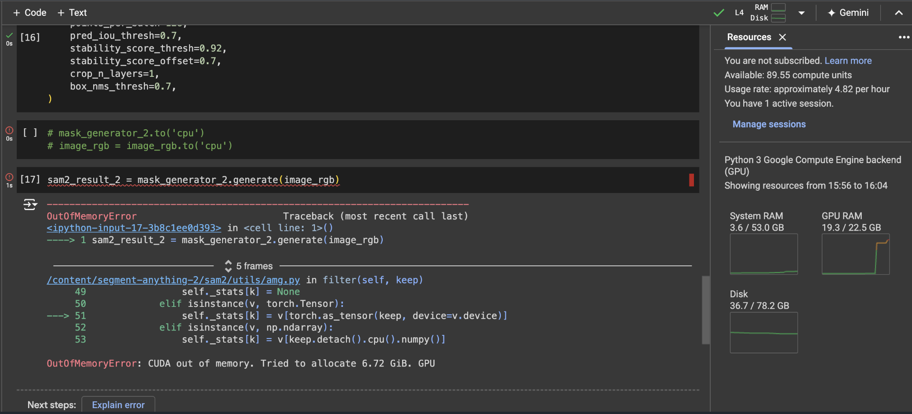

#### Download:  
```
!git clone https://github.com/facebookresearch/segment-anything-2.git
%cd {HOME}/segment-anything-2
!pip install -e . -q
```

#### Requirement:

```
!pip install -q supervision jupyter_bbox_widget
```

#### Imports
```
import cv2
import torch
import base64

import numpy as np
import supervision as sv

from sam2.build_sam import build_sam2
from sam2.sam2_image_predictor import SAM2ImagePredictor
from sam2.automatic_mask_generator import SAM2AutomaticMaskGenerator
```

### Available model checkpoints from repo

Name | link | Config file | Claimed FPS | Achieved FPS
| ---- | ---- | ---- | ---- | ---- |
sam2_hiera_tiny.pt | [download pickle](https://huggingface.co/facebook/sam2-hiera-tiny/tree/main) | `sam2_hiera_t.yaml` | 47.2 | 17
sam2_hiera_small.pt | [download pickle](https://huggingface.co/facebook/sam2-hiera-small) | `sam2_hiera_s.yaml` | 53.0 | 17
sam2_hiera_base_plus.pt | [download pickle](https://huggingface.co/facebook/sam2-hiera-base-plus) | `sam2_hiera_b+.yaml` | 43.8 | 12
sam2_hiera_large | [download pickle](https://huggingface.co/facebook/sam2-hiera-large) | `sam2_hiera_l.yaml` | 30.2 | 7


**sam2\_hiera\_tiny.pt**

* Designed for lightweight applications where speed is critical. Ideal for real-time video processing and scenarios requiring rapid response.  
* Contains 38.9 million parameters, running at approximately 47.2 frames per second (FPS) on an A100 GPU. *(Claimed By Meta)*
* Suitable for quick object tracking in videos, autonomous systems, and applications where computational resources are limited​.

**sam2\_hiera\_small.pt**

* Balances between speed and accuracy, making it suitable for medium-scale applications.  
* Contains 46 million parameters, running at about 43.3 FPS (compiled version reaches 53.0 FPS). *(Claimed By Meta)* 
* Useful for applications like augmented reality, where both speed and accuracy are important, but computational resources can still be moderately constrained​.

**sam2\_hiera\_base\_plus.pt**

* Provides a higher accuracy suitable for more demanding tasks while maintaining reasonable performance.  
* Contains 80.8 million parameters, running at approximately 34.8 FPS (compiled version reaches 43.8 FPS). *(Claimed By Meta)*  
* Ideal for detailed image segmentation tasks, such as medical imaging and scientific research, where a balance of accuracy and processing time is necessary​.

**sam2\_hiera\_large.pt**

* Focuses on high accuracy and is suitable for applications where detailed segmentation is crucial, despite slower processing times.  
* Contains 224.4 million parameters, running at about 24.2 FPS (compiled version reaches 30.2 FPS). *(Claimed By Meta)* 
* Best suited for high-precision tasks in autonomous driving, detailed video editing, and large-scale scientific research that requires the highest accuracy in segmentation.

### System Requirements

<h4>
    - Minimum T4 is required.
    - L4 is lagging on high resolution images of 3000 × 1951 px (1.3MB).
</h4>


