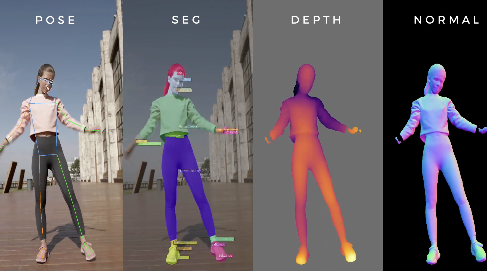
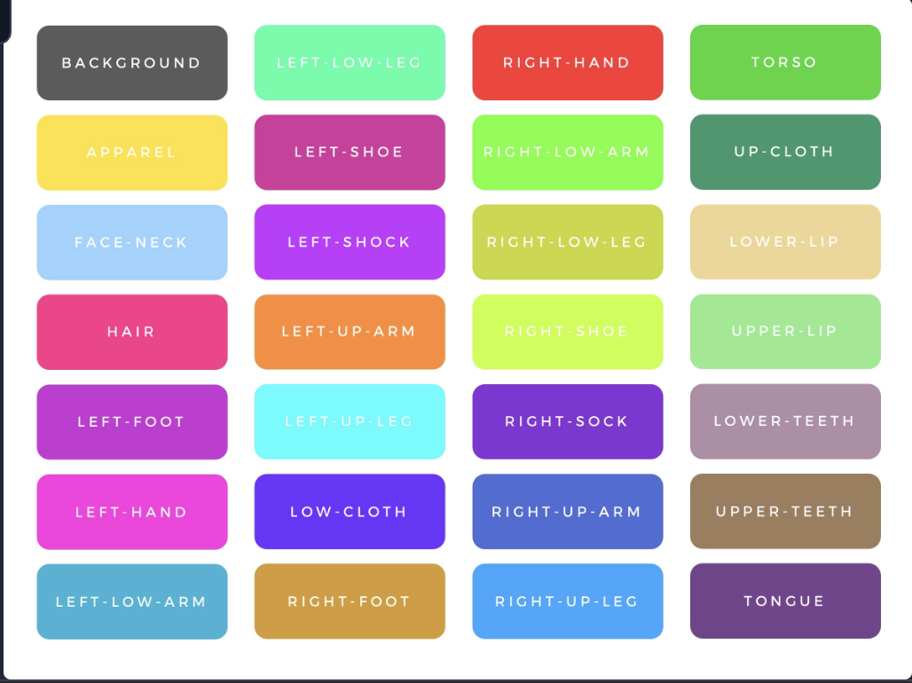

## Identifying possible advantages of using meta Sapiens model.

Click here --> https://about.meta.com/realitylabs/codecavatars/sapiens/

### For human Detection Model

### Possible Advantages of Using Meta Sapiens Model for Human Detection

The Meta Sapiens model offers several potential benefits for enhancing human detection capabilities, especially in scenarios that require detailed body tracking and identification:

1. **Separate Identifiable Masks for Each Human Body Part:**
   - The Sapiens model can generate separate masks for different body parts. This detailed segmentation allows for more precise tracking of human subjects and their movements.

2. **Inbuilt Pose Estimation:**
   - With integrated pose estimation, the model can identify and analyze walking patterns and other movements, providing a robust method to classify and distinguish between different humans in a video.

By leveraging these features, the Meta Sapiens model can improve human detection models by offering finer-grained analysis and enabling more accurate classification of individuals.

