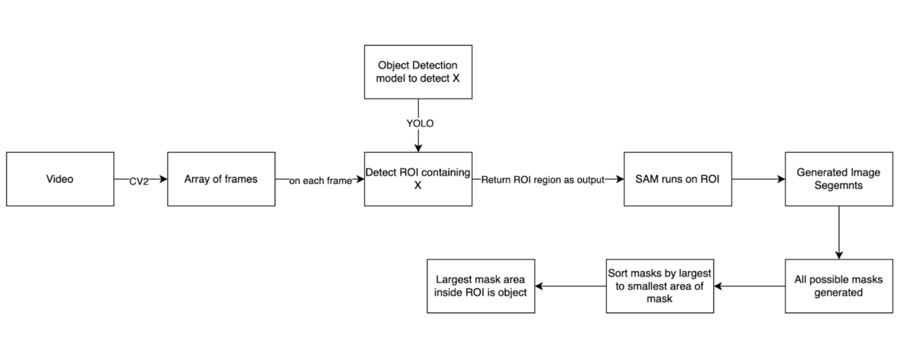
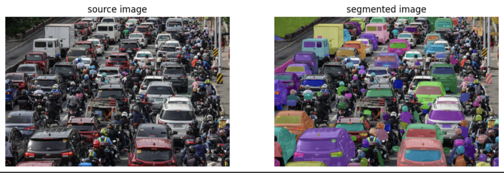
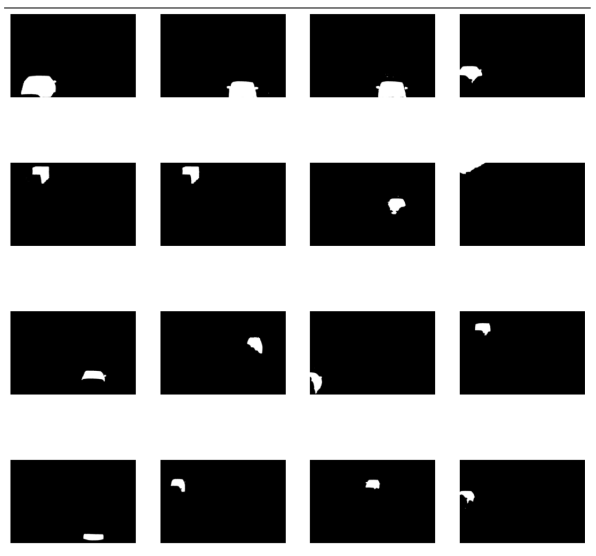
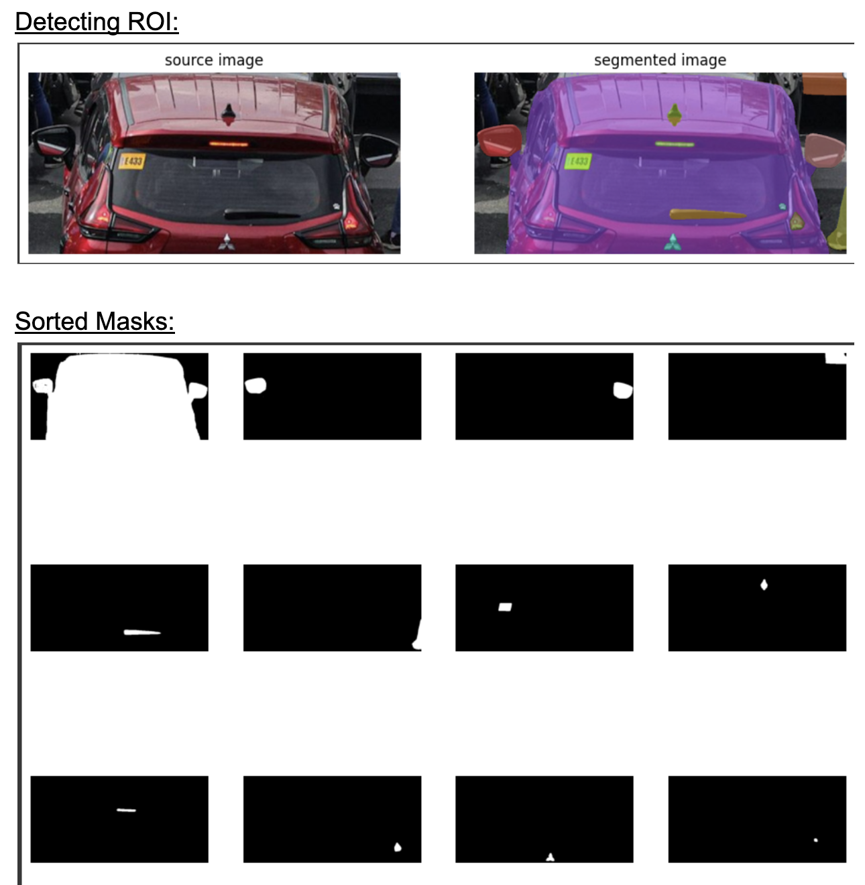

<p>Proposed Optimal pipeline</p>


### **Pipeline Components**

* Video Input  
* Frame Extraction  
* Object Detection  
* Region of Interest (ROI) Extraction  
* Segment Anything Model (SAM) Processing  
* Mask Selection and Refinement

### **Process Flow**

**1\. Video Input**  
The pipeline begins with a video input.

**2\. Frame Extraction**  
Method: OpenCV (CV2)  
Output: Array of frames

**3\. Object Detection**  
Model: YOLO   
Purpose: Detect ROI containing object X  
Input: Each frame from the array  
Output: ROI region

**4\. ROI Extraction**  
The detected ROI is extracted and passed to the next stage.

**5\. SAM Processing**  
Input: ROI region  
Output: Generated image segments (all possible masks)

**6\. Mask Selection and Refinement**  
All possible masks are generated by SAM.  
Masks are sorted from largest to smallest area.  
The largest mask area inside the ROI is identified as the target object.

### **Explanation**  
In its natural state SAM segments everything on from the given image. So if feeded an image without an aim or a possible ROI it will segment most objects from that image. Little to no support is there to use SAM to detect a particular image or mask in an image. The official documentation shows that a each mask generates a an unique point for itself. This unique point is the center of the mask. When prompting we click near an image (or we can say near its mask) the closest to the point we click the changes of that mask being selected increases. This is the process os selecting an image via sam. But to select a particular object with high accuracy mare than one prompting is required which is not possible for a live video stream.

Instead we can have an object detection model that is trained to detect a particular object. This will return is a bounding box around that object. Like the image shown below.  
We can clearly see that the “object” is occupying the largest space in this box. We cam feed this object into the SAM model to segment. The sam model will again sement everyhtng in he image but the mask with the largest area will be the object we require. As shown in the below figure. 

### **Key Considerations**

**SAM Behavior**  
SAM naturally segments all objects in a given image.  
Without specific guidance, SAM will segment most objects in the frame.

**Object Selection Challenge**  
Official SAM documentation suggests using unique points (mask centers) for prompting.  
Clicking near an image/mask increases the likelihood of selecting that mask.  
Accurate object selection often requires multiple prompts, which is impractical for live video streams.

Solution: Combination with Object Detection

An object detection model (e.g., YOLO) is used to identify and localize the target object.  
The object detection model provides a bounding box around the target.  
This bounding box serves as the ROI for SAM processing.  
The target object typically occupies the largest area within this ROI.

**Final Segmentation**  
SAM segments everything within the ROI.  
The mask with the largest area within the ROI is selected as the final segmentation of the target object.


## How to find the lagest area of the mask by sorting the masks



Sorted Masks




#### We can clearly see that the first object the mask with most area and is the required object.

```
masks = [
    mask['segmentation']
    for mask
    in sorted(sam2_result, key=lambda x: x['area'], reverse=True)
]

sv.plot_images_grid(
    images=masks[:16],
    grid_size=(4, 4),
    size=(12, 12)
)
```

