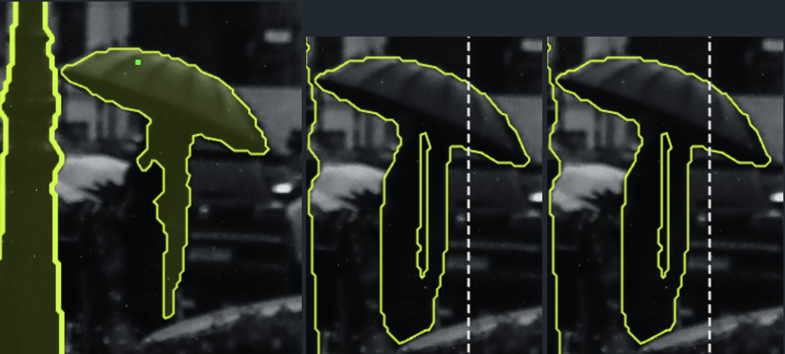
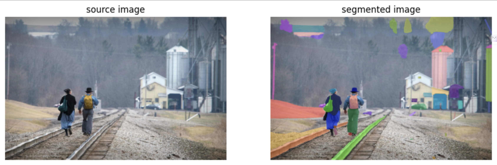
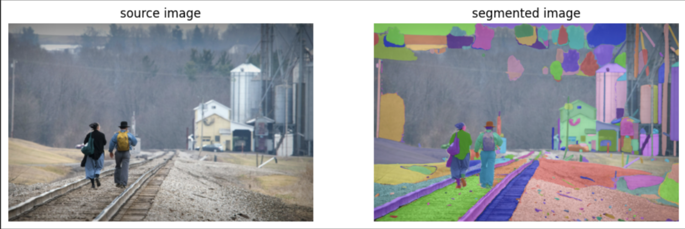
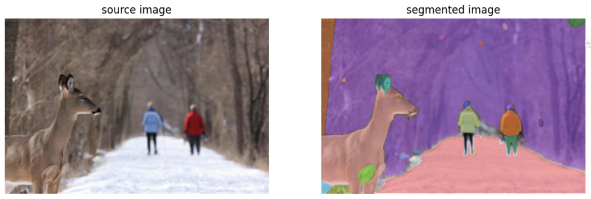
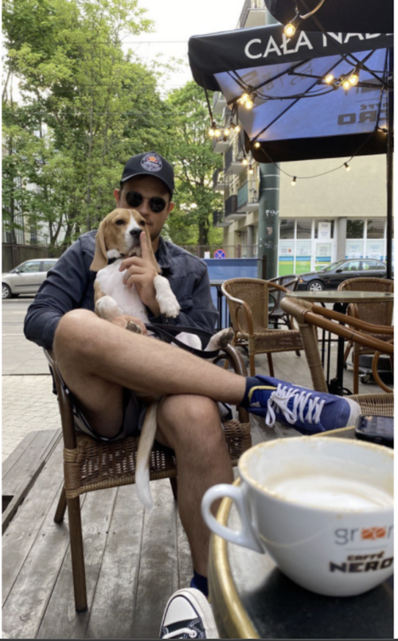
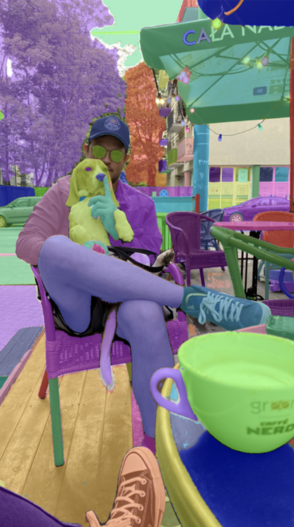

# SAM2 on Images

## Issues faces on Grayscale images



Lack of Proper colour or boundary Separation in images confuses the mask and causes either of the two:
1. No masks around the ambiguous region.
2. Insufficient mask or improper segmentation.


## Other Examples:




#### Even after tweaking the optimal parameters, the ambiguous region as mentioned remains unmasked.



#### Proper colour segmentation is needed otherwise same object gets two different masks


<hr></hr>

### Finding Optimal Parameters
By default SAM2 Uses the AutoMaskGenerator function to generate masks with uses all default parameters for the mask.
The deafault parameters are specified below:
```
class SAM2AutomaticMaskGenerator:
    def __init__(
        self,
        model: SAM2Base,
        points_per_side: Optional[int] = 32,
        points_per_batch: int = 64,
        pred_iou_thresh: float = 0.8,
        stability_score_thresh: float = 0.95,
        stability_score_offset: float = 1.0,
        mask_threshold: float = 0.0,
        box_nms_thresh: float = 0.7,
        crop_n_layers: int = 0,
        crop_nms_thresh: float = 0.7,
        crop_overlap_ratio: float = 512 / 1500,
        crop_n_points_downscale_factor: int = 1,
        point_grids: Optional[List[np.ndarray]] = None,
        min_mask_region_area: int = 0,
        output_mode: str = "binary_mask",
        use_m2m: bool = False,
        multimask_output: bool = True,
    ) -> None:
```

#### Example Illustrating the Limitations of AutoMask and the Enhanced Capabilities of Tweaked Mask

Source Image | Auto Mask Segmentation | Tweaked Parameter Mask
| ---- | ---- | ---- |
 |  | 


### Understanding what each of the parameters does:

- **model**: `SAM2Base`  
  The SAM2 model used for mask prediction. It should be an instance of the `SAM2Base` class or its derivatives.

- **points_per_side**: `Optional[int]`  
  Specifies the number of points to sample along one side of the image. The total number of points will be `points_per_side ** 2`. If this parameter is `None`, the `point_grids` parameter must provide explicit point sampling grids.

- **points_per_batch**: `int`  
  Determines the number of points to be processed simultaneously by the model. Increasing this number can improve processing speed but will also increase GPU memory usage.

- **pred_iou_thresh**: `float`  
  A filtering threshold in the range `[0,1]` that uses the model's predicted mask quality (Intersection over Union, IoU) to filter out low-quality masks.

- **stability_score_thresh**: `float`  
  A filtering threshold in the range `[0,1]` based on the stability of the mask when the cutoff used to binarize the model's mask predictions is changed.

- **stability_score_offset**: `float`  
  The amount by which to shift the cutoff when calculating the stability score. This helps in determining the robustness of the generated masks.

- **mask_threshold**: `float`  
  The threshold for binarizing the mask logits. This value determines the cutoff for classifying pixels as foreground or background in the segmentation mask.

- **box_nms_thresh**: `float`  
  The IoU threshold used in Non-Maximum Suppression (NMS) to filter out duplicate masks. Higher values will keep more masks, potentially increasing redundancy.

- **crop_n_layers**: `int`  
  If greater than 0, the mask prediction will be run iteratively on crops of the image. This parameter sets the number of cropping layers to use, where each layer has `2**i_layer` number of image crops.

- **crop_nms_thresh**: `float`  
  Similar to `box_nms_thresh`, this parameter sets the IoU threshold for NMS to filter out duplicate masks between different crops.

- **crop_overlap_ratio**: `float`  
  Sets the degree of overlap between image crops. In the first crop layer, crops will overlap by this fraction of the image length. For subsequent layers with more crops, the overlap is scaled down accordingly.

- **crop_n_points_downscale_factor**: `int`  
  Controls the downscaling of points-per-side sampled in each layer. The number of points per side in layer `n` is reduced by a factor of `crop_n_points_downscale_factor ** n`.

- **point_grids**: `Optional[List[np.ndarray]]`  
  A list of explicit grids of points used for sampling, normalized to the `[0,1]` range. The nth grid in the list is used in the nth crop layer. This parameter is mutually exclusive with `points_per_side`.

- **min_mask_region_area**: `int`  
  If greater than 0, post-processing will be applied to remove small, disconnected regions and holes in masks that are smaller than the specified area. This requires OpenCV.

- **output_mode**: `str`  
  Specifies the format in which masks are returned. Can be one of the following:
  - `binary_mask`: Returns masks as binary arrays.
  - `uncompressed_rle`: Returns masks in uncompressed Run-Length Encoding (RLE) format.
  - `coco_rle`: Returns masks in COCO-style RLE format, requiring pycocotools.

- **use_m2m**: `bool`  
  Determines whether to use a one-step refinement process that utilizes previous mask predictions for further refining the output.

- **multimask_output**: `bool`  
  Indicates whether to output multiple masks for each point in the grid. This can be useful for generating different mask hypotheses at each point.

- **kwargs**  
  Additional keyword arguments that may be used for further customization.


## SAM2AutomaticMaskGenerator returns a list of masks, where each mask is a dict containing various information about the mask
```
segmentation - [np.ndarray] - the mask with (W, H) shape, and bool type
```
```
area - [int] - the area of the mask in pixels
```
```
bbox - [List[int]] - the boundary box of the mask in xywh format
```
```
predicted_iou - [float] - the model's own prediction for the quality of the mask
```
```
point_coords - [List[List[float]]] - the sampled input point that generated this mask
```
```
stability_score - [float] - an additional measure of mask quality
```
```
crop_box - List[int] - the crop of the image used to generate this mask in xywh format
```

### Understanding the Impact of the `crop_n_layers` Parameter

The **`crop_n_layers`** parameter controls the number of iterative cropping layers applied during segmentation. Each layer increases the number of crops, allowing for a more detailed analysis of the image, focusing on different areas and refining the segmentation with each layer.

#### Observation Based on `crop_n_layers`:

- **Source Image**: 
  - The original image shows a busy traffic scene with numerous vehicles and motorcyclists. It’s complex, with many overlapping and closely packed objects.

- **n=0 (Crop Layer 0)**: 
  - At the initial crop layer (`n=0`), the segmentation is coarse, similar to the basic segmentation without any crops. The objects such as vehicles and people are roughly identified, but the boundaries are not very precise. Overlapping or closely situated objects may not be distinctly separated, and there is minimal refinement.

- **n=1 (Crop Layer 1)**: 
  - With the first cropping layer (`n=1`), the segmentation begins to refine. More objects are identified, and the segmentation boundaries become more accurate compared to `n=0`. The process of cropping allows the model to focus on smaller sections of the image, improving its ability to distinguish between closely situated objects and enhancing overall segmentation precision.

- **n=2 (Crop Layer 2)**: 
  - Further refinement occurs at the second cropping layer (`n=2`). The segmentation shows even more precise boundaries, and additional objects that were previously not segmented may now be identified. The masks conform more accurately to the shapes of individual vehicles and motorcyclists, indicating a higher resolution of segmentation due to increased focus from additional crops.

- **n=3 (Crop Layer 3)**: 
  - At the third cropping layer (`n=3`), the segmentation reaches its most detailed level. The boundaries are very precise, and nearly every object in the image is segmented. The high number of crops allows the model to meticulously analyze and separate overlapping or closely packed objects, leading to a high level of accuracy and detail in object identification.


The **`crop_n_layers`** parameter significantly enhances the model's ability to perform detailed and accurate segmentation in complex scenes. 

- **Lower `crop_n_layers` Values** (`n=0` or `n=1`): 
  - Results in less detailed segmentation, with coarser boundaries and less precise identification of objects. This is suitable for scenarios where broad object detection is sufficient.

- **Higher `crop_n_layers` Values** (`n=2` or `n=3`): 
  - Leads to more detailed and refined segmentation, allowing the model to identify and separate closely packed or overlapping objects with high precision. This is ideal for complex scenes where fine details and accurate boundaries are crucial.

In summary, increasing the **`crop_n_layers`** enhances the model's segmentation detail and accuracy by allowing iterative analysis at different levels of image granularity, effectively focusing on smaller sections of the image and refining the segmentation process with each additional layer.


### `points_per_side` Parameter:

The **`points_per_side`** parameter determines how densely the points are sampled across the image for segmentation. The total number of points sampled is `points_per_side ** 2`, meaning that increasing this parameter results in more points being considered for mask generation, while decreasing it results in fewer points.

#### Impact on Segmentation:

- **Higher `points_per_side` Value**:
  - **Finer Segmentation**: When `points_per_side` is high, more points are sampled across the image. This means the model can capture finer details and more nuanced structures within the image. For example, if a car is considered a parent object and door handles, windows, and mirrors are considered child objects, a higher `points_per_side` value can ensure that all these elements are included within the same mask. This is useful when you want to keep related parts grouped together as a single entity.
  - **Less Separation**: The increased density of points helps in maintaining the relationship between the parent and child entities, such as ensuring that the door handle and the car door are not masked separately but as parts of the same object.

- **Lower `points_per_side` Value**:
  - **Coarser Segmentation**: With a lower `points_per_side` value, fewer points are sampled. This leads to a coarser segmentation, where smaller or closely situated objects may not be accurately separated. The model might create separate masks for each part due to fewer points defining the object's boundary, resulting in entities like the car and its door handle being masked separately.
  - **More Separation**: Lower values make the model more likely to treat small details as distinct entities, resulting in separate masks for each object. This can be useful when the goal is to differentiate between closely situated or overlapping objects.

In essence, the **`points_per_side`** parameter controls the granularity of the segmentation process, affecting how the model distinguishes between parent and child entities or between different parts of an object. Adjusting this parameter allows for a flexible approach depending on the desired level of detail in segmentation.