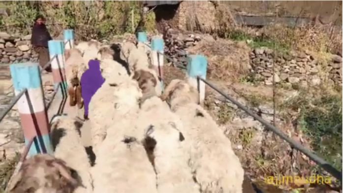
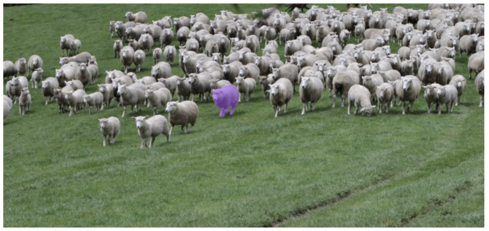

# Results from SAM Video Testing

## Test 1: Prompting One Sheep in a Herd

  <iframe width="600" height="400" src="https://www.youtube.com/embed/JjDQHeKiV80" frameborder="0" allowfullscreen></iframe>
  
  | Prompted Image | Initial Mask |
  | -------------- | ------------ |
  |  |  |

### Observations

- **Timeframe:** Between 0.03 and 0.04 seconds, the prompted object (black sheep) disappears from the frame.
- **Issue:** When the object reappears, the model detects two different objects with the same mask (both black sheep). It correctly distinguishes the black sheep from the white ones but fails to separate the two black sheep.

- **Model Used:** SAM2_TINY

### Using the SAM2 Small Model

### Analysis

<table>
<tr>
<th>Prompted Image</th>
<th>Segmented Image</th>
</tr>
<tr>
<td>  </td>
<td>  </td>
</tr>
</table>

#### Issues Identified

<table>
<tr>
<th>Tracks the sheep at the beginning</th>
<th>Overlaps when similar objects appear</th>
<th>Ambiguity with different objects in the same area</th>
</tr>
<tr>
<td>  </td>
<td>  </td>
<td>  </td>
</tr>
</table>

### Fixes Implemented

- **Improvement:** Switching to the large model resolves the issue of ambiguity, especially when multiple objects of the same class are in the frame.
- **Additional Enhancement:** Applying a polynomial mask over the plain mask improved segmentation accuracy.

---

**Notes:**
- The large model is recommended for scenarios with multiple similar objects to enhance tracking accuracy and reduce ambiguity.
- Using a more complex mask, such as a polynomial mask, helps in better distinguishing objects within the frame.

---

### Suggestions for Further Improvement

- **Detailed Metrics:** Include quantitative results such as segmentation accuracy, precision, recall, and F1 scores for each model.
- **Comparative Analysis:** Consider providing a side-by-side comparison of the performance of different models (SAM2_TINY vs. SAM2 Small vs. SAM2 Large) on various test cases.
- **Visual Annotations:** Add annotations to video frames and images to highlight issues like overlapping and ambiguity for easier understanding.

## 2nd Video 

<iframe width="560" height="315" src="https://www.youtube.com/embed/ltc3YRp9iow" frameborder="0" allowfullscreen></iframe>

Unclear Mask and Improper Tracking